<div align="center">

# Eureka

**Press a hotkey. Type a thought. Done.**

A tiny macOS menu bar app that captures a thought — plus the text you had selected,
the page you were on, or a screenshot — straight into Obsidian or Apple Notes.

[](https://github.com/Claire1217/Eureka/stargazers)
[](https://github.com/Claire1217/Eureka/releases)
[](LICENSE)

[Download](https://github.com/Claire1217/Eureka/releases) · [简体中文](README.zh-CN.md)

</div>

<p align="center">
  
</p>

## Why

Ideas show up while you are reading, coding or in a meeting — not while your notes app is open.
Switching apps to write one line costs more focus than the line is worth, so most of those
thoughts are lost. Eureka makes the cost one hotkey and one line, and it remembers *where* the
thought came from so the note still makes sense next week.

## Features

- **Global hotkey** (⌥T) — a small input appears at your cursor, in any app. Enter saves, Esc cancels.
- **Context comes along** — text you had selected is quoted under the thought, with the page URL
  (Safari, Chrome, Edge, Brave, Arc) or the app name as the source.
- **Screenshot + comment** (⌥R) — drag a region, add a line, both land in the same note.
- **Capture dot** — select text with the mouse and a small dot appears next to it; click it to
  capture with that selection attached. Can be turned off in Settings.
- **AI quick answer** — start a line with `/` to ask a question about what you selected. The answer
  appears in the panel. Works with DeepSeek out of the box and with any OpenAI-compatible endpoint.
- **Recent captures** — the floating bubble keeps your last 20 thoughts; click one to jump to it in Obsidian.
- **Obsidian or Apple Notes** — plain Markdown callouts in your vault, or a daily note in Notes.

## Install

Requires macOS 12 or later.

```bash
curl -fsSL https://raw.githubusercontent.com/Claire1217/Eureka/main/install.sh | bash
```

Or manually: download the `.zip` from [Releases](https://github.com/Claire1217/Eureka/releases),
unzip to `/Applications`, then remove the quarantine flag (the app is not notarized yet):

```bash
xattr -dr com.apple.quarantine /Applications/Eureka.app
```

### First launch

1. **System Settings → Privacy & Security → Accessibility** → enable Eureka.
   This is what lets Eureka read the text you have selected.
2. Pick your Obsidian vault (Eureka creates a `Eureka/` folder inside it) or choose Apple Notes.
3. Optional: **E!** menu bar icon → **Settings…** → paste an API key to enable `/` questions.

> Because releases are ad-hoc signed, macOS asks for the Accessibility permission again after
> each update. Remove the old Eureka entry from the list and add the new one.

### Build from source

```bash
git clone https://github.com/Claire1217/Eureka.git
cd Eureka && ./deploy.sh
```

Needs the Xcode command line tools. If you rebuild often, run `./setup_cert.sh` once and use
`./build.sh` — a stable signing identity keeps the Accessibility permission across rebuilds.

## Usage

| Action | Default hotkey |
|--------|--------|
| Capture a thought | ⌥T |
| Screenshot + comment | ⌥R |

- **Enter** saves, **Shift+Enter** adds a line, **Esc** cancels
- Select text before pressing the hotkey to attach it as context; press Enter on an empty input to save just the selection
- Start with `/` to ask the AI instead of saving
- Hotkeys are configurable in Settings

## Where things go

```
your-vault/Eureka/
  2026-06-29/
    Thoughts.md       # every thought of the day, as callouts
    attachments/      # screenshots
```

<p align="center">
  
</p>

Each thought is a standard Obsidian callout, so the file stays readable anywhere:

```markdown
> [!thought-coral] 10:15
> onboarding step 3 loses 40% — make job title optional
> > Step 3: "Tell us about yourself" — 42% drop-off 【[mixpanel.com/report](https://…)】
```

The colored card look comes from a small CSS snippet that Eureka installs into
`.obsidian/snippets/` and enables when you pick your vault (reopen Obsidian if it was running).
To install it by hand, copy `thought-cards.css` there and enable it under
Settings → Appearance → CSS snippets.

With Apple Notes, thoughts are appended to a note called `Thoughts — YYYY-MM-DD`. Notes cannot
take images through automation without losing earlier ones, so screenshots are saved to
`~/Pictures/Eureka/` and the note gets the file path.

## Privacy

Everything is written locally — to your vault folder or to Apple Notes. Eureka has no server,
no account and no analytics. The only network request it ever makes is the `/` question (your
question plus the selected text) sent to the AI endpoint you configured, and only when you use it.
Whatever was already on your clipboard is never saved: when an app does not expose its selection,
Eureka sends a ⌘C to read it and puts your previous clipboard back right after.

## Configuration from the command line

Everything in Settings is a `defaults` key, which also makes Eureka scriptable:

```bash
defaults write com.eureka.app vaultPath "/path/to/vault/Eureka"
defaults write com.eureka.app storageBackend "obsidian"        # or "notes"
defaults write com.eureka.app llmApiKey "sk-your-key"           # optional
defaults write com.eureka.app selectionToolbarEnabled -bool NO  # hide the capture dot

# Any OpenAI-compatible chat completions endpoint works:
defaults write com.eureka.app llmApiBase "https://api.openai.com/v1/chat/completions"
defaults write com.eureka.app llmModel "gpt-4o-mini"
defaults write com.eureka.app llmSystemPrompt "Answer in one short paragraph."

killall Eureka; open /Applications/Eureka.app
```

<details>
<summary><strong>Install with an AI coding agent</strong></summary>

```bash
# 1. Install and configure in one go
EUREKA_VAULT_PATH="/absolute/path/to/vault/Eureka" \
EUREKA_BACKEND="obsidian" \
  bash -c "$(curl -fsSL https://raw.githubusercontent.com/Claire1217/Eureka/main/install.sh)"

# 2. Restart after changing any default
killall Eureka 2>/dev/null; open /Applications/Eureka.app
```

One step cannot be automated: System Settings → Privacy & Security → Accessibility → enable Eureka.

</details>

## Known limitations

- ⌥T and ⌥R normally type `†` and `®`; pick other hotkeys in Settings if you need those characters.
- Some Electron apps do not expose their selection, so Eureka falls back to ⌘C there. In editors that copy the whole line when nothing is selected (VS Code), that line can show up as context.
- Source URLs are only captured from the browsers listed above (Firefox has no scripting interface).
- The UI is light-mode only for now.

## License

[MIT](LICENSE)
