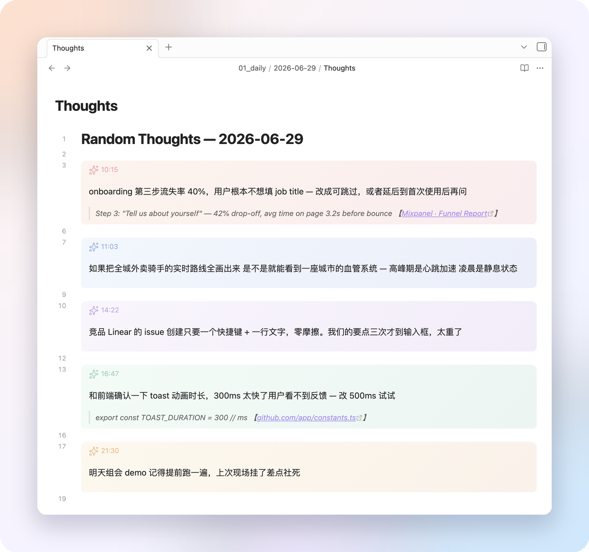

<div align="center">

# Eureka

**按下快捷键，写一句话，完事。**

一个很小的 macOS 菜单栏工具：随手记下一个想法，连同你当时选中的文字、所在的网页或一张截图，
直接写进 Obsidian 或 Apple 备忘录。

[下载](https://github.com/Claire1217/Eureka/releases) · [English](README.md)

</div>

<p align="center">
  
</p>

## 为什么做这个

想法总是出现在读文章、写代码、开会的时候，而不是打开笔记软件的时候。为了一句话切换应用，
打断的注意力比这句话本身更贵，于是大部分想法就这么丢了。Eureka 把成本降到一个快捷键加一行字，
并且记住这个想法是从哪儿来的，下周再看还能看懂。

## 功能

- **全局快捷键**（⌥T）：在任意应用里，输入框出现在光标旁。回车保存，Esc 取消。
- **自动带上下文**：选中的文字会作为引用附在想法下面，并标注来源网页（Safari、Chrome、Edge、Brave、Arc）或应用名。
- **截图加评论**（⌥R）：框选一块区域，写一句话，两者存进同一条笔记。
- **捕获圆点**：用鼠标选中文字后，旁边出现一个小圆点，点它即可带着选中内容记录。可在设置里关闭。
- **AI 快问**：以 `/` 开头就是向 AI 提问（会带上选中的文字），答案直接显示在面板里。默认 DeepSeek，也支持任何 OpenAI 兼容接口。
- **最近记录**：悬浮气泡保留最近 20 条，点一条直接跳到 Obsidian 对应位置。
- **Obsidian 或 Apple 备忘录**：存成 vault 里的纯 Markdown callout，或备忘录里的每日笔记。

## 安装

需要 macOS 12 或更高版本。

```bash
curl -fsSL https://raw.githubusercontent.com/Claire1217/Eureka/main/install.sh | bash
```

或手动：从 [Releases](https://github.com/Claire1217/Eureka/releases) 下载 `.zip`，解压到 `/Applications`，
然后去掉隔离标记（应用尚未公证）：

```bash
xattr -dr com.apple.quarantine /Applications/Eureka.app
```

### 首次启动

1. **系统设置 → 隐私与安全性 → 辅助功能** → 开启 Eureka。读取选中文字需要这个权限。
2. 选择你的 Obsidian vault（Eureka 会在里面建一个 `Eureka/` 文件夹），或选择 Apple 备忘录。
3. 可选：点菜单栏 **E!** → **Settings…** → 填入 API key，开启 `/` 提问。

> 目前的发布包是 ad-hoc 签名，所以每次更新后 macOS 会要求重新授予辅助功能权限：
> 把列表里旧的 Eureka 删掉，再添加新的即可。

### 从源码构建

```bash
git clone https://github.com/Claire1217/Eureka.git
cd Eureka && ./deploy.sh
```

需要 Xcode 命令行工具。经常重新构建的话，先跑一次 `./setup_cert.sh`，之后用 `./build.sh`：
固定的签名身份能让辅助功能权限在重新构建后保留。

## 使用

| 操作 | 默认快捷键 |
|------|------|
| 记录想法 | ⌥T |
| 截图加评论 | ⌥R |

- **回车**保存，**Shift+回车**换行，**Esc** 取消
- 先选中文字再按快捷键，选中内容会作为上下文；输入框留空直接回车，则只保存选中内容
- 以 `/` 开头是问 AI，不会保存
- 快捷键可在设置里修改

## 存在哪

```
你的vault/Eureka/
  2026-06-29/
    Thoughts.md       # 当天所有想法，callout 格式
    attachments/      # 截图
```

<p align="center">
  
</p>

每条想法都是标准的 Obsidian callout，在任何编辑器里都能读：

```markdown
> [!thought-coral] 10:15
> onboarding 第三步流失 40%，job title 改成可跳过
> > Step 3: "Tell us about yourself" — 42% drop-off 【[mixpanel.com/report](https://…)】
```

彩色卡片的样式来自一个 CSS 片段，选好 vault 时 Eureka 会自动装进 `.obsidian/snippets/` 并启用
（如果 Obsidian 正开着，重开一次即可）。手动安装：把 `thought-cards.css` 复制进去，
在 设置 → 外观 → CSS 代码片段 里启用。

使用 Apple 备忘录时，想法会追加到名为 `Thoughts — YYYY-MM-DD` 的笔记里。通过自动化往备忘录写图片
会导致之前的图片丢失，所以截图会存到 `~/Pictures/Eureka/`，笔记里记录文件路径。

## 隐私

所有内容只写在本地：你的 vault 文件夹，或 Apple 备忘录。Eureka 没有服务器、没有账号、没有统计。
唯一的联网请求是 `/` 提问（你的问题加上选中的文字），发给你自己配置的 AI 接口，并且只在你使用时发生。
剪贴板里原有的内容永远不会被保存：当某个应用不暴露选中文字时，Eureka 会发一次 ⌘C 来读取，
随后立刻把你原来的剪贴板还原。

## 命令行配置

设置里的每一项都是一个 `defaults` 键，方便脚本化：

```bash
defaults write com.eureka.app vaultPath "/path/to/vault/Eureka"
defaults write com.eureka.app storageBackend "obsidian"        # 或 "notes"
defaults write com.eureka.app llmApiKey "sk-your-key"           # 可选
defaults write com.eureka.app selectionToolbarEnabled -bool NO  # 关闭捕获圆点

# 任何 OpenAI 兼容的 chat completions 接口都可以：
defaults write com.eureka.app llmApiBase "https://api.openai.com/v1/chat/completions"
defaults write com.eureka.app llmModel "gpt-4o-mini"
defaults write com.eureka.app llmSystemPrompt "用中文简洁回答，技术术语保留英文。"

killall Eureka; open /Applications/Eureka.app
```

## 已知限制

- ⌥T 和 ⌥R 原本会输入 `†` 和 `®`；需要这两个字符的话，请在设置里换快捷键。
- 部分 Electron 应用不暴露选中文字，Eureka 在这些应用里会退回到 ⌘C 的方式。在「无选区时复制整行」的编辑器（如 VS Code）里，这一行可能被当成上下文带上。
- 来源网址只支持上面列出的浏览器（Firefox 没有脚本接口）。
- 界面目前只有浅色模式。

## 许可

[MIT](LICENSE)
